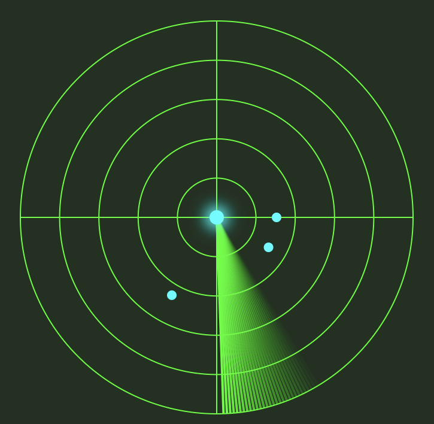

# AndKot-RadarViewSample

レーダー画面のViewを作ってみた。  
 

[English](README.md)

## 使い方
- レイアウトXMLに配置するだけ。
- レーダー内の点は邪魔なら適当に消しちゃってください。
  RadarView.kt(69): radarPointsを空すれば消えます。
- app:sweepRangeに角度(0-359°)を設定すると、右図の様に円弧のレーダーになります。
- app:sweepRangeを設定しないと、左図の様に円のレーダーになります。
- app:isSweepWrappedにtrueを設定するとレーダー線が折り返す様になります。

## 属性の説明
|属性|型|値|説明|
|---|---|---|---|
|sweepRange|float|0-359°|円弧の角度|
|isSweepWrapped|boolean|true/false|折り返すかどうか|

詳細は[ココ](https://zenn.dev/rg687076/articles/90d4c289775a7a)
