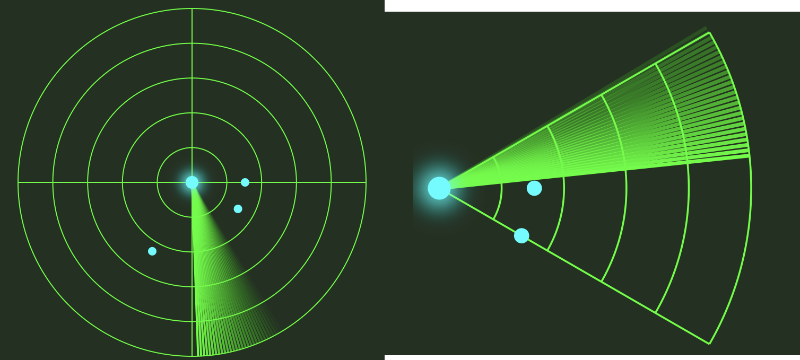
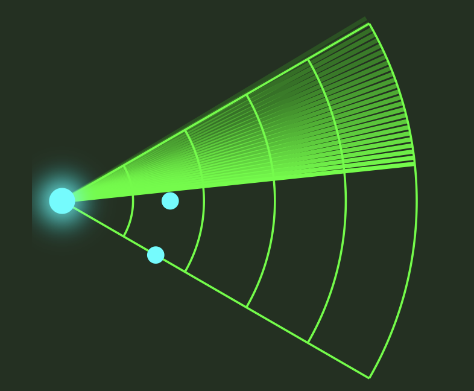

# AndKot-RadarViewSample

I gave it a shot and made a radar screen view.
 

[日本語](README-ja.md)

## Usage
- Just place it in your layout XML.
- If the points inside the radar are distracting, feel free to remove them.
  In RadarView.kt(line69), clearing radarPoints will hide them.
- Setting app:sweepRange to an angle (0–359°) will display an arc-style radar like the image on the right.
- If app:sweepRange is not set, the radar will appear as a full circle, like the image on the left.
- Setting app:isSweepWrapped to true will make the radar sweep line wrap around.

## Attribute Description
|Attribute|Type|Value|Description|
|---|---|---|---|
|sweepRange|float|0–359°|Arc angle|
|isSweepWrapped|boolean|true/false|Whether to wrap or not|
